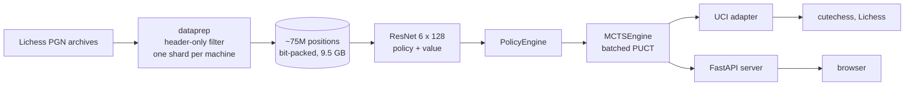

# Chess-AI

A chess engine built from scratch: a residual policy/value network trained on human
Lichess games, driving a batched Monte Carlo Tree Search, and playable through UCI
(cutechess, Lichess) or a web interface.

**No engine distillation at any point.** The network never sees a Stockfish evaluation.
It learns from two signals only: which move a human played, and how the game ended.
Everything the engine knows, it inferred from human play and its own search.

## Key results

- **About 75 million positions** from 2200+ rated rapid and classical Lichess games,
  24 monthly archives covering 2023 and 2024, parsed in parallel across school lab
  machines
- **1.82M-parameter** residual policy/value network, with the convolution, batch norm,
  move encoding and training loop written from scratch on top of autograd
- **Batched MCTS** (PUCT, virtual loss, repetition-aware) that wins **20 games out of 20**
  against the same network playing without search
- **UCI adapter** with time management and Chess960, deployable on cutechess and Lichess
- **FastAPI server** with a browser interface, compute caps and per-IP rate limiting

## Pipeline



## Evaluation

Measured with `chessai.arena`, colours alternating to cancel the first-move advantage.

| Matchup | Games | Score |
|---|---|---|
| MCTSEngine (200 sims) vs PolicyEngine, same weights | 20 | **20 - 0** |
| PolicyEngine (old net, step 32000) vs MaterialBot | 100 | 98.5% |
| PolicyEngine (old net, step 32000) vs RandomBot | 100 | 98.5% |
| PolicyEngine (old net, step 14000) vs MaterialBot | 100 | 84.5% |
| MaterialBot vs RandomBot | 100 | 92.5% |
| MCTSEngine vs Stockfish `UCI_Elo` 1320, 60+0.6 | 2 | 2 - 0 |
| MCTSEngine vs Stockfish `UCI_Elo` 2200, 7 min + 7 s | 2 | 2 - 0 |
| MCTSEngine vs Stockfish `UCI_Elo` 2500, 7 min + 7 s | 2 | 0 - 2 |

The 20 - 0 settles the central hypothesis of the project: the network already knew what
to play, and search removes the blunders that cost it its games. It is too clean a score
to measure the gap in Elo, which is why the next measurements are against Stockfish at
calibrated strength and against humans on Lichess.

The two baselines are deliberately weak. **None of these percentages is an Elo rating.**

- **RandomBot** plays a uniformly random legal move. Performance floor.
- **MaterialBot** plays mate in one when available, otherwise the capture with the
  highest victim value, otherwise a random move. No lookahead, so it hangs pieces
  constantly, but it punishes every undefended piece left by its opponent.

## Searchless play and its failure mode

Without search, the network plays by pattern. Openings are sound, plans are coherent,
then it drops a piece. The typical failure is a capture into a defended square.

The cause is structural. In games between strong players, a capture is almost always
good, because the human calculated before playing it. The network learns that "rook
takes bishop" is a frequent, strong pattern. It never learns to check whether the square
is defended, because that check happens in the player's head and leaves no trace in the
move list. In one informal game against the 1300-rated chess.com bot, the policy went two
pieces up, then hung its queen to a piece attacking it from across the board.

That is exactly the gap MCTS closes.

## Search

`MCTSEngine` wraps a `PolicyEngine` and uses it as its evaluator. It builds no network of
its own.

**Selection** follows the AlphaGo variant of PUCT:

```
Q(s,a) + c_puct * P(s,a) * sqrt(sum_b N(s,b)) / (1 + N(s,a))
```

with `c_puct = 1.5`. The prior `P` comes from the policy head, so the network decides
where the search looks first, and the observed values `Q` take over as visits accumulate.

**Batched evaluation.** A single-position forward pass is dominated by kernel launch
overhead: profiling showed 87% of search time in the network, one position at a time. The
search therefore collects up to 32 leaves before a single batched forward pass. To stop
the 32 descents from converging on the same leaf, each traversed edge receives a
**virtual loss** (one extra visit and a value penalty of 0.3), reverted during backup.
A leaf already queued in the current batch is flagged and the duplicate descent is
cancelled.

**Sign convention.** The value head was trained from White's point of view. The search
reasons from the side to move. The conversion happens once, at the leaf, and the backup
then flips the sign at every level. A second conversion anywhere would produce an engine
that plays the worst moves without raising a single error, so the tests check the sign
explicitly in both colours.

**Terminal positions** never reach the network: a mate is worth -1 for the side to move,
a draw 0.

**Repetitions.** Any position repeated once inside the search, or reaching the fifty-move
rule, is scored as a draw. A winning line keeps a positive `Q`, so the engine avoids
repeating when ahead, and the same rule lets it steer toward a repetition when behind.

**Budget and deadline.** The search stops at whichever comes first, the node budget or
the time limit, checked between batches. The final move is the **most visited** root
move, not the one with the highest `Q`, and `list_moves` returns the visit distribution
rather than the raw priors.

Dirichlet noise at the root (`alpha = 0.3`, `epsilon = 0.25`) is implemented and off by
default, since it only matters for self-play.

## Networks

Two checkpoints ship in `parameters/`.

| | `ckpt_32000.pt` (old) | `ckpt_60000.pt` (current) |
|---|---|---|
| Data | 3.59M positions, 1900+, base time 180 s | ~75M positions, 2200+, base time 600 s |
| Input planes | 18 | 17 |
| Value head | tanh, MSE | logit, BCE |
| Train/val split | by position | by contiguous blocks |
| Batch, steps | 512, 33k | 1024, 60k |
| Parameters | 1,819,907 | 1,818,755 |

`PolicyEngine` reads the configuration stored in the checkpoint, so both networks load
through the same code. The current one is the default everywhere.

## Data

`dataprep.py` turns a monthly Lichess archive into a shard of three aligned arrays:
`uint8` board tensors, `int16` move indices, `int8` results.

The current dataset covers the 24 monthly archives of 2023 and 2024.

**Header-only filtering.** Parsing a full game with `chess.pgn` is expensive, and at a
2200 threshold with rapid time controls fewer than one game in a thousand survives. The
script therefore splits the raw text into games, reads the headers alone, and only parses
the moves of games that pass the filter. That skips about 99.9% of the parsing work.

Filters: both players at least 2200, base time at least 600 seconds, `Termination` equal
to `Normal` (a loss on time contradicts the final position and would poison the value
target), and a defined result. Up to 25 positions per game, skipping the first 10 plies,
because consecutive positions from one game are nearly identical and produce correlated
gradients.

**Distributed build.** Each archive is independent, so each lab machine processes one
month and writes its own shard. No communication, and a machine that drops only costs
its shard. Training itself was deliberately not distributed: synchronising gradients over
a campus network between heterogeneous machines would cost more than the computation.

### Why 2200 and rapid only

Supervised learning caps out near the level of its data, so a stronger dataset raises the
ceiling. At 3.6M positions the 1900 threshold was a quality-for-volume trade. With twenty
times more games available, the stricter filter became affordable, and excluding blitz
matters as much as the rating: a 2200 player in bullet plays well below their rating.

## Training

`trainhard.py` trains the current network from scratch.

**Bit-packing.** The raw board tensors weigh 80 GB. Each plane is binary, so `np.packbits`
brings them down to 136 bytes per position and 9.5 GB total, small enough to sit in RAM.
Random access into a memory-mapped file cost about a second per batch and starved the
GPU.

**Block split.** The file is cut into 1000 contiguous blocks, 2% for validation and 2%
held out for test. Splitting by position would place positions from one game on both
sides and inflate the validation score, which is what happened with the old network.

**Value head as a probability.** The value head outputs a logit trained with
binary cross-entropy against `(result + 1) / 2`, so a draw is a target of 0.5.
`PolicyEngine` maps it back with `2 * sigmoid(z) - 1`, onto the same scale as a tanh.

**Optimisation.** AdamW with weight decay 1e-2, 500 warmup steps then cosine decay from
`1e-3`, gradient clipping at 1.0, loss `cross_entropy(policy) + bce(value)`.

## Encoding

**Position**: planes 0 to 11 are one-hot pieces (`PNBRQK` then `pnbrqk`), 12 is the side
to move, 13 to 16 the castling rights. The old network also had a halfmove-clock plane,
dropped in the current one because the `uint8` storage had truncated it to zero
everywhere. Boards are always encoded from White's point of view.

**Moves**: the AlphaZero scheme, `4672 = 64 x 73`. Origin square crossed with a move type:
56 queen-like moves, 8 knight jumps, 9 underpromotions. Index `73 * square + type`. Queen
promotions share the index of the matching pawn push, which is why decoding needs the
board. The layout folds onto the 8x8 grid, so the policy head emits 73 channels and
flattens straight into the 4672 logits with no dense layer.

## Architecture

```
input (B, 17, 8, 8)
  conv 3x3 17 -> 128, batch norm, ReLU
  6 x residual block:
      conv 3x3 -> batch norm -> ReLU -> conv 3x3 -> batch norm -> add input -> ReLU
  policy head: conv 1x1 128 -> 73, permute, flatten -> (B, 4672) logits
  value head:  conv 1x1 128 -> 1, flatten -> 64 -> 256 -> 1
```

Mapping channels directly onto move types saves the usual 9.6M-parameter dense
projection, so almost all parameters sit in the trunk.

## Handwritten versus PyTorch

The point was to build the network, not to assemble it.

Written from scratch as `nn.Module` subclasses: `Linear` (a convolution in disguise),
`unfoldX` (im2col as nine shifted slices of a zero-padded board), `BatchNorm2d` with
running statistics and the train/eval switch, `ReLU`, `LinearFlat`, `ResBlock`,
`ChessNet`, plus both encodings, the data pipeline, the training loops and the search.

Taken from PyTorch: autograd, `nn.Module` and `nn.Parameter`, `AdamW`, the loss
functions, `F.pad` and `F.conv2d`. The handwritten unfold-and-matmul is mathematically
identical to `F.conv2d` but materialises a tensor nine times the activation size at every
layer. Switching the forward pass cut a training step from 922 ms to 474 ms. The explicit
version stays in the code as the reference.

## UCI adapter

`chessai-uci` speaks the Universal Chess Interface on stdin and stdout, and contains no
chess logic of its own: it parses `position` and `go`, calls `engine.analyse`, and prints
`info` and `bestmove`.

- **Time management.** `movetime` and `nodes` are honoured directly. Under a clock, the
  engine spends the remaining time divided by 30 plus 80% of the increment.
- **Faster openings.** During the first 8 moves the node budget is capped at 1200, since
  spending full thinking time on well-known positions wastes clock for later.
- **Chess960** through the `UCI_Chess960` option.
- **Score** reported in centipawns via `111.7 * tan(1.562 * value)`.
- Terminal positions answer `bestmove 0000`. All logs go to stderr, since anything on
  stdout is protocol.

Settings through environment variables: `CHESSAI_CKPT`, `CHESSAI_SIMS` (default 400) and
`CHESSAI_ENGINE` (`mcts` or `policy`). The launchers `chessai-new.bat` and
`chessai-old.bat` load each network, which makes head-to-head matches in cutechess a
single command.

## Lichess deployment

The engine runs as a Lichess BOT through the official
[lichess-bot](https://github.com/lichess-bot-devs/lichess-bot) harness, with
`protocol: uci` pointing at the launcher. The exact binary measured in cutechess is the
one playing online, rather than a second code path through the lichess-bot `homemade`
interface.

## Web interface

A FastAPI server exposes `POST /moves/analyse`: a FEN in, the best move, the top
candidates with their visit share, the value, the node count and the time out. A static
page with a draggable board plays against it. The client holds the game state and the
server keeps none, which removes sessions, cleanup and concurrency bugs between requests.

The server is designed to be exposed through Cloudflare Tunnel, so its limits live on the
server side and are not negotiable:

- at most **800 nodes and 2 seconds** per analysis; the client can ask for less, never more
- at most **2 concurrent** analyses, then `503`
- **30 requests per minute** per IP, keyed on `CF-Connecting-IP` only when the request
  comes through the local tunnel, so the header cannot be forged from outside
- request bodies capped at **4 KB** before being read in full, then `413`
- a malformed FEN or an impossible position returns `422`; a finished game returns `409`,
  since a checkmate FEN is valid and the problem is the state, not the format

Routes are plain `def` rather than `async def`, so inference runs in the threadpool and
never blocks the event loop.

## Correctness checks

Most of these fail silently if broken: a wrong encoding still trains, the loss still goes
down, and the bot is simply bad.

- **Move round-trip**: `index_to_move(move_to_index(m), board) == m` for every legal move
  over thousands of random positions, with no collision inside a position.
- **Flatten ordering**: a one-hot `(1, 73, 8, 8)` tensor lands at `73 * square + type`.
- **Convolution equivalence**: handwritten unfold against `F.conv2d`, same weights.
- **Search**: the board is restored after `analyse`, visits sum to the budget, mate in
  one is found, the root value is positive for the side a queen up in both colours,
  terminal positions raise, node and time limits are respected.
- **Server**: tested with an injected deterministic engine through
  `dependency_overrides`, so the tests need neither torch nor a checkpoint.
- **Overfit check**: 500 fixed positions memorised to a loss near 1e-4 while validation
  stays around 8.6.

## Layout

```
src/chessai/
├── encoding.py        board <-> tensor, move <-> index
├── dataprep.py        header-filtered PGN parsing, one shard per archive
├── model.py           handwritten layers, ResBlock, ChessNet
├── trainhard.py       current training run
├── train.py, data.py  first-generation pipeline, kept for reference
├── arena.py           engine versus engine matches
├── engine/            Limit, Analysis, Engine, policy, mcts, baselines
├── adapters/uci.py    UCI adapter
└── server/            FastAPI app, schemas, limits, static page
parameters/            the two checkpoints
notebooks/             exploratory work, not part of the package
```

The notebooks keep earlier versions of the same components, including the layers before
`nn.Module` and the handwritten convolution before `F.conv2d`. Nothing in `src/` imports
them.

## Installation

```bash
git clone https://github.com/OscarFLasky/chess-ai
cd chess-ai
pip install -e ".[dev]"
```

`torch` is a declared dependency, and PyPI serves the CPU build. For a CUDA build,
install torch first from the index given on pytorch.org, then the package.

```bash
chessai-uci                                   # UCI engine on stdin/stdout
uvicorn chessai.server.app:app                # web interface on localhost:8000
python -m chessai.dataprep in.pgn.zst out/    # one dataset shard
```

## Known gaps

- En passant has no input plane, and the network cannot see repetitions. The search
  handles repetitions, the network does not.
- Boards are always encoded from White's point of view. Encoding from the side to move
  would roughly halve what the network has to learn.
- The deadline is checked between batches of 32 simulations, so a move can overrun its
  allotted time by up to one batch.
- Each shard is built in memory and written once, so an interrupted machine loses its
  shard.
- Kernel size is read from a module-level global in `Linear` while `ChessNet` takes it as
  an argument.
- No CI yet.

## Improvement leads

**Longer training.** 60,000 steps of 1024 positions is about 0.85 of an epoch over the
training set, so each position has been drawn less than once on average. The cosine
schedule decays the learning rate to zero, which flattens the loss curve by
construction, so the plateau does not show that the network has reached its capacity.
A second cosine cycle resumed from the current checkpoint would tell the two apart.

**Training throughput.** `bfloat16` with `channels_last`, the fused `nn.BatchNorm2d`
instead of the handwritten one, `torch.relu` instead of `x * (x > 0)`, and
`torch.compile`.

**Search.** Reusing the subtree of the move actually played instead of rebuilding the
tree every move, and tuning `c_puct` and the node budget against Stockfish.

**Self-play.** Generating games with the search and retraining on its visit
distributions, starting from the supervised network. Game generation needs no
communication between machines, so it distributes the same way the dataset did.

**Architecture.** A transformer over 64 tokens, one per square, is a competitive
alternative to the convolutional trunk. Only the trunk would change.

## License

MIT.
